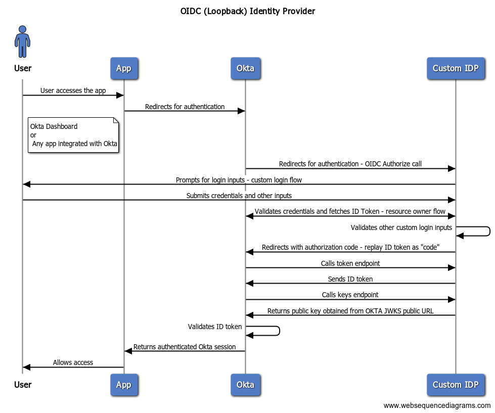
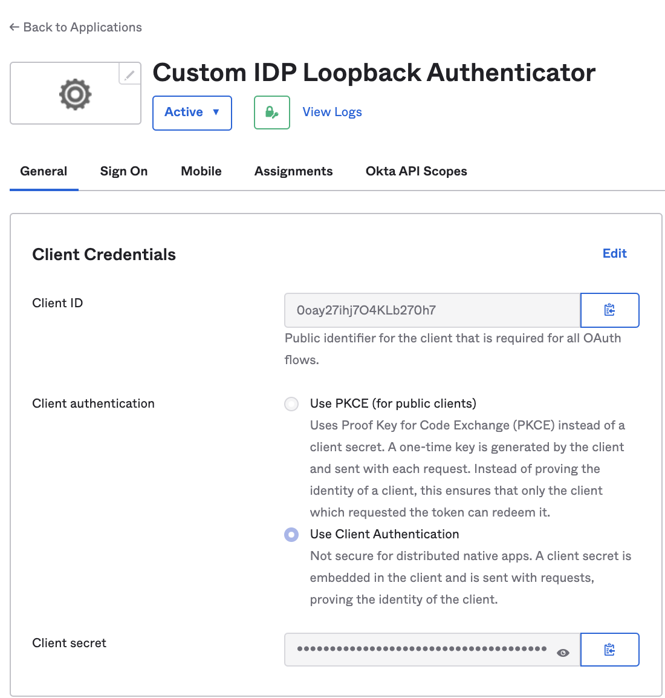
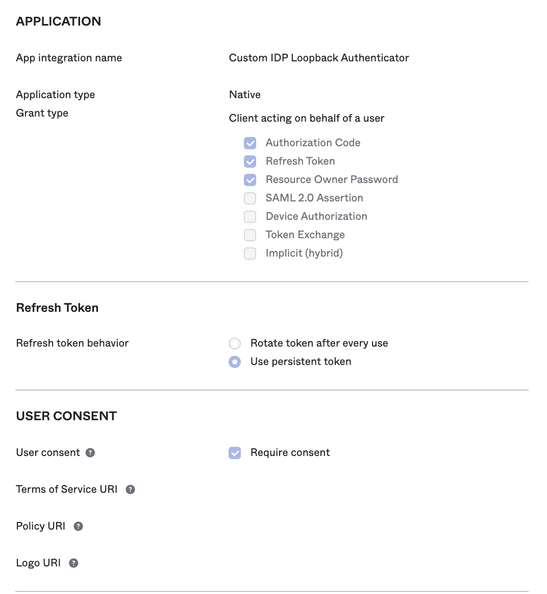
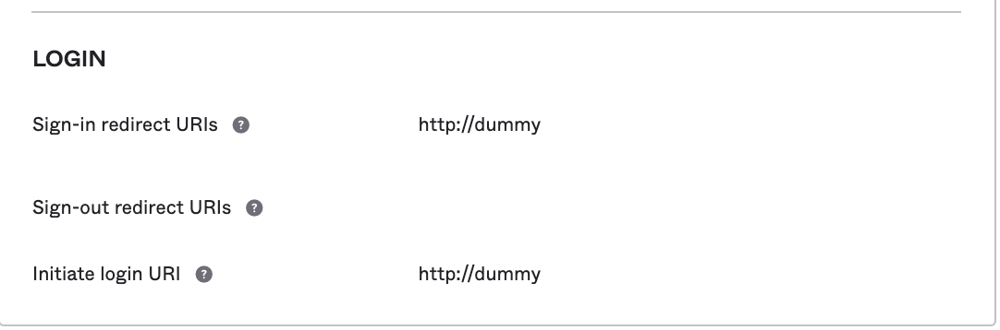
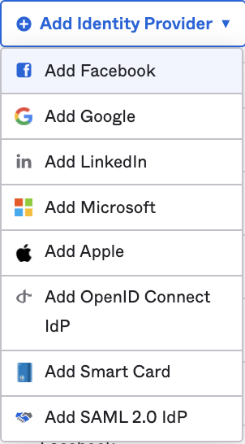
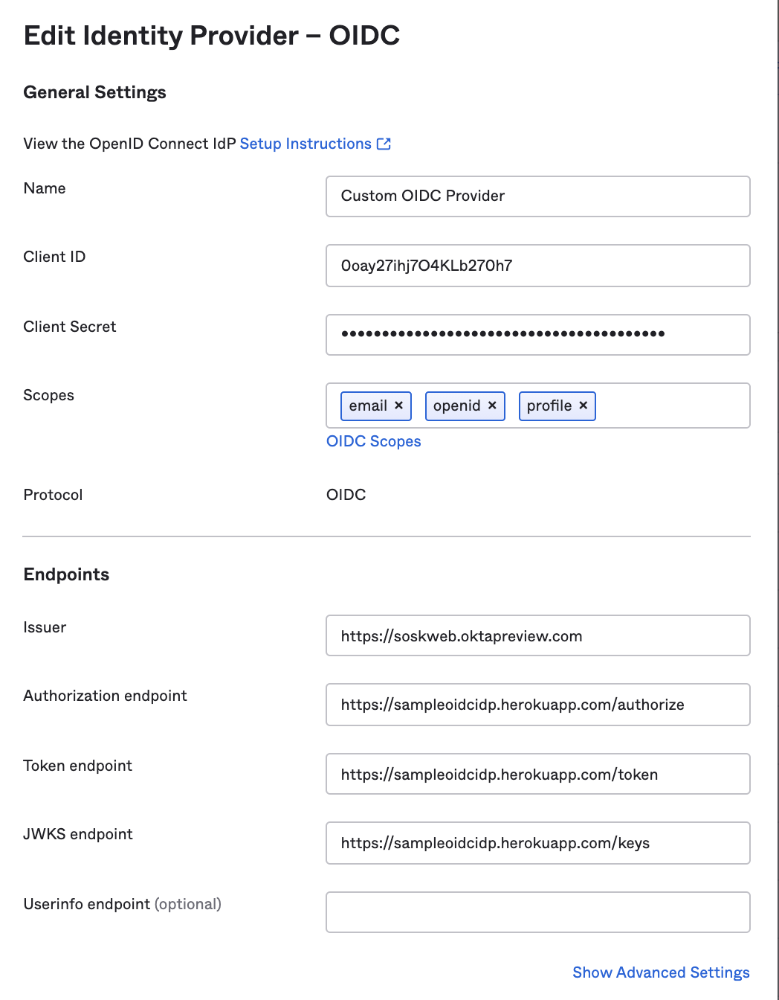
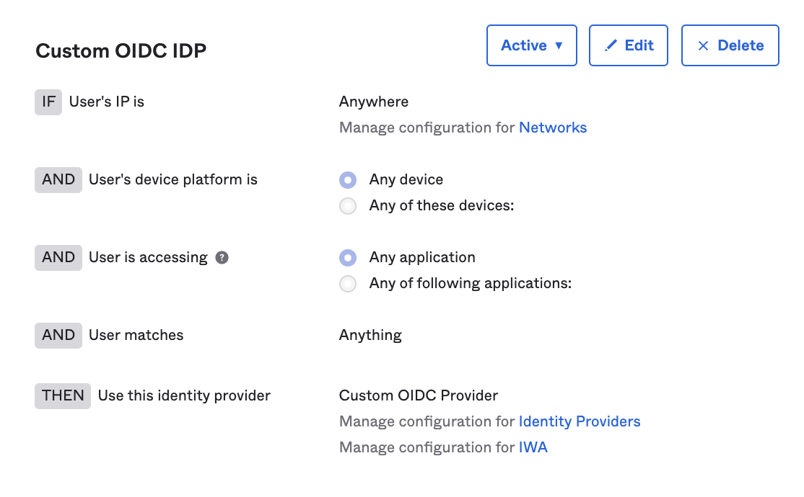
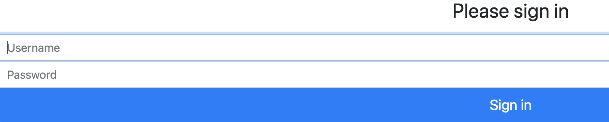

# Loopback OpenID Connect Provider

This sample app implements a custom **OpenID Connect** Identity Provider that can be used as an external IDP in Okta.
In the background, it uses Okta (loop-back) itself, to generate the OpenID authentication token. The architecture is as follows:



## Installation
```
git clone https://github.com/indranilokg/Okta-CIAM.git
```

## Okta configuration - Part 1

* Create a `Native` OIDC application from Okta admin console. Enable `Resource Owner Password` grant. Assign the application to `Everyone` group. 






* Note the `Client ID` and `Client Secret` values from the app. Those values are needed in the custom OIDC provider.


## Project setup
* From the application root folder, install the dependencies.

```
$ cd Custom-OIDC-Provider/loopbackidp
$ npm install
```

* From the application root folder, copy `env.example` to `.env`

* Change the parameter values in the `.env` to point to your Okta environment
```
# Backend authentication app - Okta Base URL
BASE_URL=https://<Your okta org>.okta[preview].com

# Backend authentication app - Client ID
CLIENT_ID=<Enter Client ID>

# Backend authentication app - Client Secret
CLIENT_SECRET=<Enter Client Secret>
```


### Deploy to Heroku

* Get a free [Heroku account](https://signup.heroku.com/), if not already there.

* Open command line and go to the project root folder. 

```
$ cd Okta-CIAM/
```
* Login to Heroku and create an application

```
$ heroku login

$ heroku create sampleoidcidp <- provide a different name
```
* Deploy the application

```
$ git subtree push --prefix Custom-OIDC-Provider/loopbackidp heroku main
```
* After deployment, the application should be available at 

```
https://<your-app-name>.herokuapp.com
Example -
https://sampleoidcidp.herokuapp.com
```


## Okta configuration - Part 2

* Go to the **Security -> Identity Provider** menu from Okta admin console. Create a new OIDC Identity Provider.



* Provide the following values from your application to configure the provider

```
    Issuer: https://<Your okta org>.okta[preview].com

    Scopes: email, openid, profile

    Client ID: <Client ID of previously created app> (Not used in sample implementation)

    Client Secret: <Client Secret of previously created app> (Not used in sample implementation)
    
    Authorization endpoint: https://sampleoidcidp.herokuapp.com/authorize
    
    Token endpoint: https://sampleoidcidp.herokuapp.com/token
    
    JWKS endpoint: https://sampleoidcidp.herokuapp.com/keys

```



* Create routing rule to auto-redirect Okta login to your custom application




## Test

Start a new browser session. Go to Okta dashboard. It should redirect to the custom login page of your app. Enter valid Okta credentials for a user. 

Confirm that the authentication is successful and user lands to her dashboard homepage.

