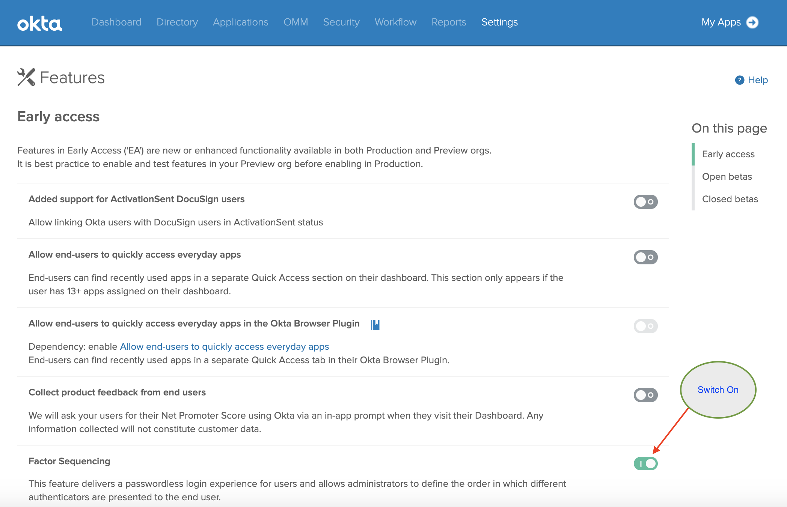
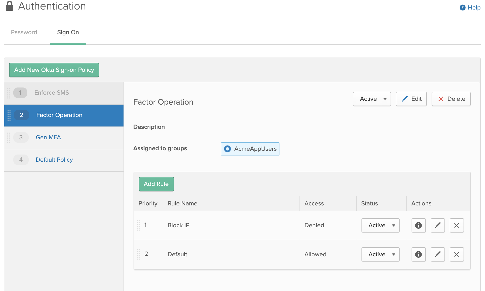
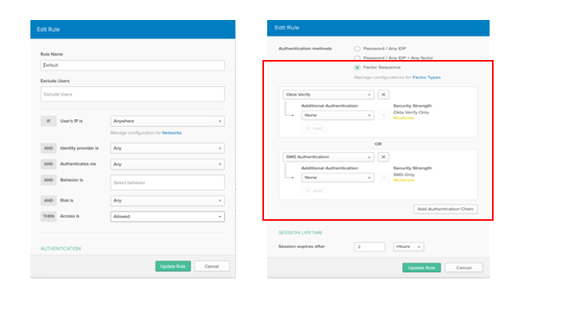
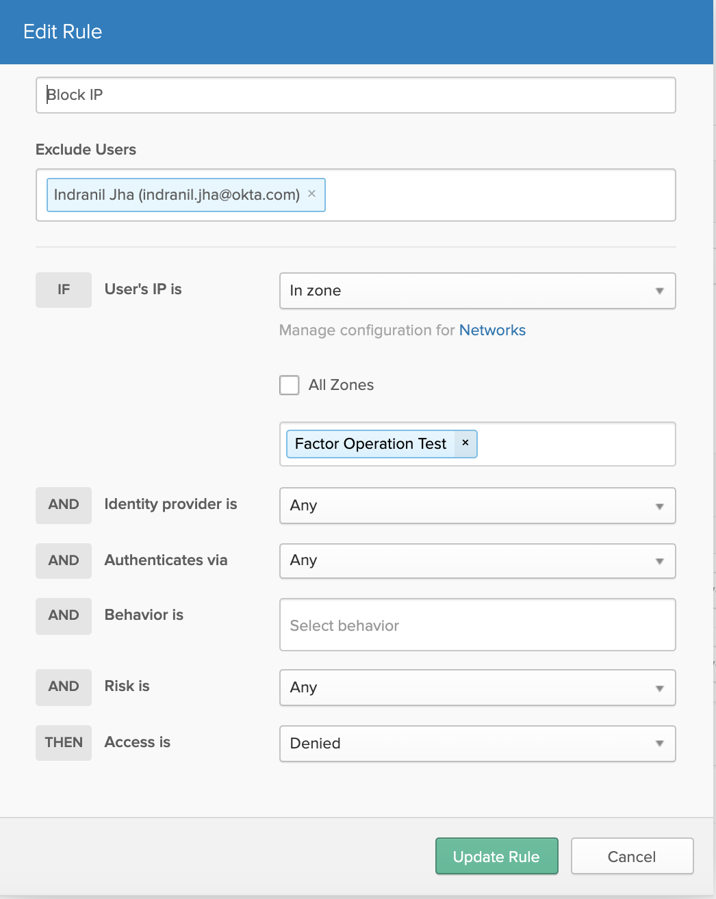

# Okta Factor Demo

## Description

**Okta MFA Everywhere** is a sample application that uses newer features of Okta to perform
a **Multifactor Authentication** flow to a Specific Application. Sometimes Customers of Okta
use their own Identity System to perform Primary Authentiation, but they want to add
Multifactor to an in-house built application, and leverage Okta **Sign-on Policy** to a
specific application.

## Sites

- [Blog](https://oktablog.twisec.com/2020/05/24/policy-aware-mfa/) - Design Pattern - Adaptive Policy Aware Step-up MFA
- [Demonstration](https://www.youtube.com/watch?v=u5p0bF4Hcc0)
- [Live Example](https://oktamfaeverywhere.herokuapp.com/) 

## Benefits

The benefit of this approach is that the Multifactor Authentication Step can be performed
entirely from the Browser, and **no Server Side code** is required and no **Okta API KEY** is needed.

## Installation
```
git clone https://github.com/indranilokg/Okta-MFA-Everywhere.git
```

## Okta configuration

Configure the following on your Okta org -

### <a name="orgsignon"></a>Org Sign-on scenario

* Enable the password sequencing Early Access feature.



* Create authentication policy for your target group of users



* Add policy rule to match your password-less MFA sequence. Example - MFA fullfillment with Okta Verify or SMS



<blockquote>
The factor sequences defined in the rule needs to be exactly how your application expects the MFA sequence. For example, if your application wants to support either Okta Verify or SMS for step-up MFA, the factor sequence defined should be as shown above on the screenshot.
</blockquote>

* Add additional contextual policies as needed by your application




### App Sign-on scenario

* All the Org Sign-on [steps](#orgsignon)


## Project setup
* From the project root folder, install the dependencies.

```
$ npm install
```

* From the project root folder, copy `env.example` to `.env`

* Change the value of `VUE_APP_OKTA_BASE_URL` in the `.env` to point to your Okta org
```
VUE_APP_OKTA_BASE_URL=https://your-okta-org.okta[preview].com
```


### Compiles and hot-reloads for development
```
npm run serve
```

### Compiles and minifies for production
```
npm run build
```

