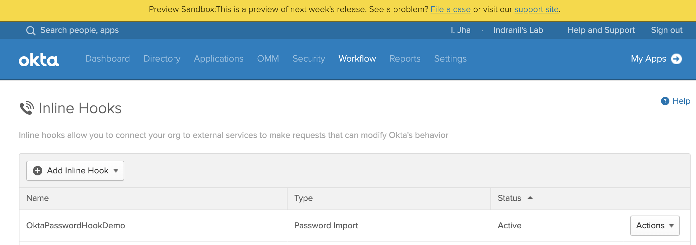

# Sample Just-In-Time Migration - Local Store

This sample application is based on the steps defined in the [Okta Developer Guide](https://developer.okta.com/docs/guides/password-import-hook/nodejs/overview/).

It leverages a local file based user store. The user name and password combinations are stored in a local `users.json` file. The application can be easily adopted to verify against a remote store instead.

## Installation
```
git clone https://github.com/indranilokg/Okta-User-Migration.git
```

## Project setup

* From the project root folder, install the dependencies.

```
$ npm install
```
* From the project root folder, change `users.json` to store your target user name and password combinations

### Deploy to Heroku

* Get a free [Heroku account](https://signup.heroku.com/), if not already there.

* Open command line and go to the project root folder. 

```
$ cd Okta-User-Migration/
```
* Login to Heroku and create an application

```
$ heroku login

$ heroku create oktpasswordhookdemo <- provide a different name
```
* Deploy the application

```
$ git subtree push --prefix Just-in-time-Migration/Generic-Sample-NodeJS heroku master
```
* After deployment, the application should be available at 

```
https://<your-app-name>.herokuapp.com
Example -
https://oktpasswordhookdemo.herokuapp.com
```

## Okta configuration

* First, obtain the *base64* encoded value for the following **basic authentication** attributes for the application -

	```
	admin:supersecret
	```
You can use any base64 encoding utility or go online to [https://www.base64encode.org](https://www.base64encode.org/)


 

* Go to the **Inline Hooks** menu from Okta admin console.


* Create a new **Password Import** hook.


* Provide your application values in the `create hook` dialog and `save` the hook.

	
	```
	Name: OktaPasswordHookDemo

	URL: https://<your-app-name>.herokuapp.com/passwordimport

	Authentication field: Authorization

	Authentication secret: Basic YWRtaW46c3VwZXJzZWNyZXQ=
	```





## Test the migration

Users need to be created (without password) using the [Create User with Password Import Inline Hook](https://developer.okta.com/docs/reference/api/users/#create-user-with-password-import-inline-hook) API for the import hook to work.

Here is an example API call -


```
curl -v -X POST \
-H "Accept: application/json" \
-H "Content-Type: application/json" \
-H "Authorization: SSWS ${api_token}" \
-d '{
  "profile": {
    "firstName": "John",
    "lastName": "Wells",
    "email": "jwells@mailinator.com",
    "login": "jwells@mailinator.com"
  },
  "credentials": {
    "password" : {
      "hook": {
        "type": "default"
      }
    }
  }
}' "https://${yourOktaDomain}/api/v1/users?activate=true"
```

The hook will be triggered **transparently**, when the user logs in with her existing password to `Okta` for the **first time**. 

Checkout the **system logs** to confirm that the hook is working and password import is successful. Look for the following **events** after first time login -

```
Successfully processed inline hook response
Import user password
```


### Re-test password import for a user

**Password Import** hook is triggered during first time login only. In order to **re-test** the password import for a user, her credentials need to be reset.

Following is an example API call to `reset` the user's credentials -

```
curl -v -X POST \
-H "Accept: application/json" \
-H "Content-Type: application/json" \
-H "Authorization: SSWS ${api_token}" \
-d '{
  "credentials": {
    "password" : {
      "hook": {
        "type": "default"
      }
    }
  }
}' "https://${yourOktaDomain}/api/v1/users/<ID>"
```
