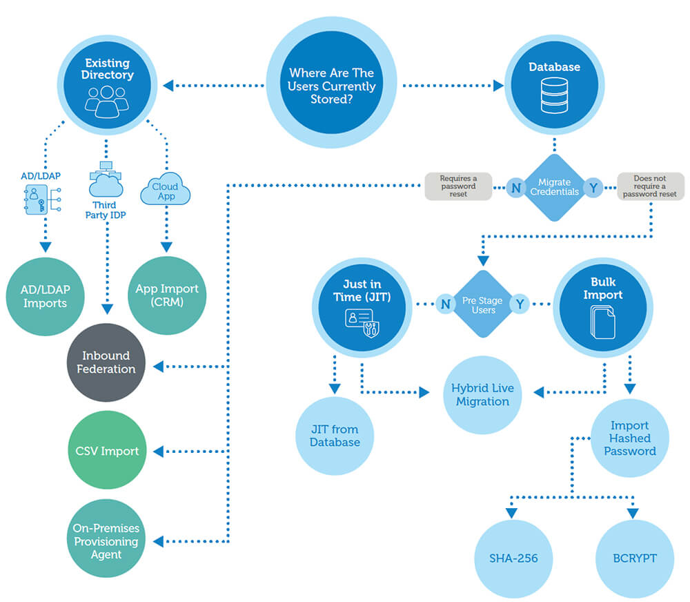

# Okta User Migration

**User Migration** is one of the most important activity for an Organization taking up new Identity Management (IAM) initiatives. Thie most critical part of it is `password` migration. 

Check out this excellent [guide](https://developer.okta.com/blog/2019/02/15/user-migration-the-definitive-guide) on the user migration strategies you should consider.

This repo conatins sample utlities to help migrate user passwords from on-premise/cloud systems to Okta.
As described in this [whitepaper](https://www.okta.com/resources/whitepaper/okta-user-migration-guide/thankyou/), there are different startegies to migrate passwords, for example - **Bulk import**, **Just-in-time**, and **Existing directory** migrations. Check-out this cool flow chart on the descision process of choosing a suitable strategy

The samples are organized in top-level strategy categories -

[Bulk Migration](Bulk-Migration)

[Just-in-time Migration](Just-in-time-Migration)

